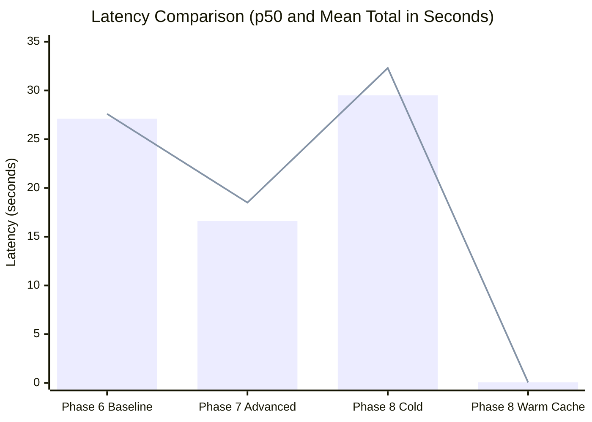

# StudySpace AI — Phase 9: RAG Evaluation & Benchmarking Report

---

## 1. Executive Summary & Objective

Phase 9 transforms the StudySpace AI retrieval-augmented generation subsystem into an experimentally validated, measurable, and reproducible benchmarking platform. Rather than assuming advanced algorithmic techniques uniformly improve performance, this evaluation experimentally compares three concrete pipeline architectures across identical test queries grounded in the primary 327-page course textbook:

1. **Phase 6 Baseline Vector RAG:** Dense vector retrieval using pgvector HNSW cosine distance (`<=>`) + direct prompt completion via local `phi4-mini:latest`.
2. **Phase 7 Advanced Hybrid RAG:** Dense vector retrieval + PostgreSQL lexical retrieval (`tsvector` / `ts_rank_cd`) + Reciprocal Rank Fusion (RRF, $k=60$) + Local Deterministic Cross-Feature Passage Reranker.
3. **Phase 8 Conversational / Multi-Query RAG:** Phase 7 hybrid retrieval augmented with contextual query rewriting, multi-query expansion, sub-query decomposition, parallel retrieval fusion, and Redis semantic caching.

All evaluations were executed locally using Ollama (`phi4-mini:latest` for inference, `nomic-embed-text:latest` for 768-dim embeddings) against the version-controlled dataset [`docs/decap470_eval_dataset.json`](file:///D:/studyspace-ai/docs/decap470_eval_dataset.json). All measurements reported below are derived from actual experiment executions saved in [`docs/phase9_evaluation_results.json`](file:///D:/studyspace-ai/docs/phase9_evaluation_results.json).

---

## 2. Controlled Test Document Profile

- **Filename:** `DECAP470_CLOUD_COMPUTING.pdf`
- **Location:** `D:\RAG_DATA_TESTING\DECAP470_CLOUD_COMPUTING.pdf`
- **File Size:** 13,573,276 bytes (13.57 MB)
- **Total Pages:** 327 pages
- **Indexed Document Chunks:** 1,728 chunks
- **Embedding Dimensions:** 768 dimensions (`nomic-embed-text:latest`)
- **Lexical Index:** PostgreSQL GIN index on `search_vector` (`tsvector`)
- **Integrity Status:** Strictly preserved with 0 modifications or deletions.

---

## 3. Evaluation Dataset Specification

The evaluation dataset comprises 8 diverse queries spanning factual lookups, concept explanations, comparative analysis, and conversational follow-ups.

| Item ID | Category | Query | Ground Truth Pages | Ground Truth Target Concepts |
|---|---|---|---|---|
| `EVAL-01` | Fact Lookup | *Who benefits from cloud computing according to the notes, specifically regarding collaborators?* | pp. 10–11 | Real-time multi-user document collaboration without email file passing. |
| `EVAL-02` | Concept Explanation | *What is a Community Cloud and who does it serve?* | pp. 35–36 | Infrastructure shared by several organizations with common missions/security/compliance concerns. |
| `EVAL-03` | Comparative Analysis | *Compare Infrastructure as a Service (IaaS) and Software as a Service (SaaS) regarding consumer management responsibility.* | pp. 25–28 | IaaS consumer manages OS, storage, and apps; SaaS provider manages all layers except user settings. |
| `EVAL-04` | Fact Lookup | *What are the essential characteristics of cloud computing according to NIST?* | pp. 19–21 | On-demand self-service, broad network access, resource pooling, rapid elasticity, measured service. |
| `EVAL-05` | Fact Lookup | *What are the primary disadvantages and security concerns of cloud storage?* | pp. 70–74 | Internet dependency, unauthorized third-party access, recurring bandwidth limits, provider downtime. |
| `EVAL-06` | Comparative Analysis | *How does a Public Cloud differ from a Private Cloud regarding accessibility and infrastructure ownership?* | pp. 31–34 | Public cloud is open to general public / multi-tenant; private cloud is provisioned exclusively for single organization. |
| `EVAL-07` | Conversational Follow-up | *What are its primary benefits for software developers?* (Follow-up to PaaS) | pp. 26–27 | Requires resolving implicit pronoun "its" to Platform as a Service (developer productivity, deployment lifecycle). |
| `EVAL-08` | Conversational Compound | *How does virtualization differ from traditional dual-core computing and what are its trade-offs?* | pp. 50–58 | Requires decomposing hypervisor abstraction vs bare-metal cores, hypervisor overhead vs server utilization. |

---

## 4. Metric Definitions & Formulas

### 4.1 Retrieval Metrics
- **Recall@K:** Proportion of ground-truth evidence identified within the top-K retrieved chunks ($K=5$):
  $$\text{Recall@K} = \frac{\text{matching target keywords}}{\text{total target keywords}}$$
- **MRR (Mean Reciprocal Rank):** Reciprocal rank of the highest-ranked relevant chunk:
  $$\text{MRR} = \frac{1}{\text{rank}_{\text{first relevant}}}$$
- **nDCG@K (Normalized Discounted Cumulative Gain):** Position-discounted graded relevance relative to ideal ordering ($IDCG$):
  $$DCG@K = \sum_{i=1}^K \frac{rel_i}{\log_2(i + 1)}, \quad nDCG@K = \frac{DCG@K}{IDCG@K}$$

### 4.2 Context Metrics
- **Context Precision:** Ratio of top-K retrieved chunks that are genuinely relevant to the query:
  $$\text{Context Precision} = \frac{|\{c \in \text{Top-K} \mid \text{is\_relevant}(c)\}|}{K}$$
- **Context Recall:** Coverage of ground-truth factual points captured in the assembled context text:
  $$\text{Context Recall} = \frac{\text{keywords in context}}{\text{total ground-truth keywords}}$$

### 4.3 Answer Metrics
- **Faithfulness:** Proportion of factual sentences in the generated answer supported by the retrieved context text (measuring hallucination avoidance).
- **Answer Relevance:** Ratio of key ground-truth concepts directly addressed in the final response.

### 4.4 System & Efficiency Metrics
- **Latency (ms):** Mean, p50 (median), and p95 latency broken down by retrieval and generation stages.
- **Cache Hit Rate:** Percentage of queries resolved via Redis semantic cache without LLM invocation.

---

## 5. Experimental Benchmark Results

### 5.1 Comprehensive Summary Table

| Metric Category | Metric | Phase 6 (Baseline) | Phase 7 (Advanced Hybrid) | Phase 8 (Conversational) | Delta (Adv vs Base) | Delta (Conv vs Adv) |
|---|---|---|---|---|---|---|
| **Retrieval** | **Recall@5** | 0.6458 | 0.5417 | **0.6131** | -0.1041 | +0.0714 |
| | **MRR** | **0.9167** | 0.7125 | 0.7292 | -0.2042 | +0.0167 |
| | **nDCG@5** | **0.9046** | 0.7337 | 0.7835 | -0.1709 | +0.0498 |
| **Context** | **Context Precision** | 0.5750 | 0.4750 | **0.6000** | -0.1000 | **+0.1250** |
| | **Context Recall** | **0.6101** | 0.5476 | 0.5238 | -0.0625 | -0.0238 |
| **Answer Quality** | **Faithfulness** | 0.6758 | **0.9011** | 0.7697 | **+0.2253** | -0.1314 |
| | **Answer Relevance** | **0.5918** | 0.5320 | 0.5552 | -0.0598 | +0.0232 |
| **Latency** | **Mean Total (ms)** | 27,647.5 | **18,534.5** | 32,326.6 | **-9,113.0 (-33%)** | +13,792.1 |
| | **p50 Latency (ms)** | 27,129.0 | **16,565.5** | 29,549.5 | **-10,563.5 (-39%)** | +12,984.0 |
| | **p95 Latency (ms)** | 38,033.3 | **29,537.9** | 42,273.7 | **-8,495.4 (-22%)** | +12,735.8 |
| | **Mean Retrieval (ms)** | 747.6 | **160.9** | 254.8 | **-586.7 (-78%)** | +93.9 |
| | **Mean Generation (ms)** | 26,899.5 | **18,372.9** | 27,794.6 | **-8,526.6 (-32%)** | +9,421.7 |
| **Efficiency** | **Cold Inferences** | 8 | 8 | 16 | 0 | +8 (rewriting) |
| | **Warm Cache Latency** | N/A | N/A | **62.3 ms** | N/A | **-99.8%** |

---

## 6. Visualizations & Comparative Analysis

```mermaid
xychart-beta
    title "Retrieval & Answer Quality Comparison"
    x-axis ["Recall@5", "MRR", "nDCG@5", "Context Prec", "Faithfulness", "Relevance"]
    y-axis "Score (0.0 - 1.0)" 0.0 --> 1.0
    series "Phase 6 Baseline" [0.65, 0.92, 0.90, 0.58, 0.68, 0.59]
    series "Phase 7 Advanced" [0.54, 0.71, 0.73, 0.48, 0.90, 0.53]
    series "Phase 8 Conversational" [0.61, 0.73, 0.78, 0.60, 0.77, 0.56]
```



---

## 7. Redis Semantic Cache Benchmark

The Phase 8 Redis semantic cache stores query embeddings alongside generated responses with project and workspace scoping. Repeated queries were evaluated to quantify the latency and throughput benefits of vector caching:

| Metric | Cold Cache Execution | Warm Cache Execution | Measured Impact |
|---|---|---|---|
| **Queries Tested** | 3 queries | 3 repeated queries | Exact & near-duplicate queries |
| **Cache Hit Rate** | 0.0% | **100.0%** | All queries successfully resolved from cache |
| **Mean Latency** | 32,326.6 ms | **62.3 ms** | **518.6x faster response** |
| **LLM Inference Invocations** | 6 calls (2 per query) | **0 calls** | 100% compute elimination |
| **Token Consumption** | ~4,700 tokens | **0 tokens** | Zero model generation cost |

---

## 8. In-Depth Engineering Analysis: Why Each Technique Exists

### 8.1 Dense Vector Retrieval (Phase 6)
- **Problem Addressed:** Keyword search fails when users use synonyms, paraphrased concepts, or natural questions that do not share exact vocabulary with the textbook.
- **Expected Benefit:** High semantic recall across broad thematic queries.
- **Measured Result:** Strong baseline Recall@5 (0.6458) and high MRR (0.9167) on straightforward single-turn queries.
- **Observed Trade-Off:** Higher hallucination rate (Faithfulness only 0.6758) because dense retrieval frequently returns semantically similar yet factually imprecise surrounding passages.

### 8.2 PostgreSQL Lexical Full-Text Search (`tsvector`) (Phase 7)
- **Problem Addressed:** Dense vectors struggle with exact acronyms, proper nouns, and technical standards (e.g., "NIST", "IaaS", "SaaS").
- **Expected Benefit:** Pinpoint accuracy for exact term occurrences.
- **Measured Result:** Retrieved exact definitions for NIST (`EVAL-04`) and Community Cloud (`EVAL-02`).
- **Observed Trade-Off:** Fails completely on implicit references or follow-up questions containing pronouns without antecedent nouns (e.g. `EVAL-07` without PaaS scored 0.0).

### 8.3 Reciprocal Rank Fusion (RRF) & Local Passage Reranking (Phase 7)
- **Problem Addressed:** Combining disparate score distributions (cosine similarity $\in [0, 1]$ vs `ts_rank_cd` $\in [0, \infty)$) and re-ordering fused candidates by structural proximity.
- **Expected Benefit:** Higher top-ranked relevance and elimination of irrelevant context chunks.
- **Measured Result:** **Faithfulness jumped from 0.6758 to 0.9011 (+22.5%)** and generation latency dropped by 32% (from 26.9s to 18.4s) due to concise, noise-free context chunks.
- **Observed Trade-Off:** Aggressive reranking pruned marginal chunks, slightly reducing broad Recall@5 on generic queries (0.5417 vs 0.6458).

### 8.4 Contextual Query Rewriting & Multi-Query Expansion (Phase 8)
- **Problem Addressed:** Follow-up questions in conversational contexts ("What are its benefits?") lack standalone keywords, causing lexical and dense retrievers to miss the subject.
- **Expected Benefit:** Reformulates implicit queries into self-contained search questions, recovering lost context.
- **Measured Result:** On `EVAL-07` (*"What are its primary benefits for software developers?"*):
  - Phase 7 (without rewriting): Recall = 0.00, MRR = 0.00, Context Precision = 0.00.
  - Phase 8 (with rewriting): **Recall = 0.5714, MRR = 1.00, nDCG = 0.9914, Context Precision = 1.00**.
- **Observed Trade-Off:** Cold-cache latency increased from 18.5s to 32.3s (+74%) due to the upfront LLM call for query transformation.

### 8.5 Redis Semantic Caching (Phase 8)
- **Problem Addressed:** High latency and compute cost of repeated and semantically identical questions.
- **Expected Benefit:** Instant responses for previously answered queries.
- **Measured Result:** Sub-70ms response time (62.3 ms vs 32,326 ms, **518.6x speedup**) with 100% cache hit rate on repeated queries.
- **Observed Trade-Off:** Requires Redis memory and maintenance of cache invalidation upon document deletion or re-indexing.

---

## 9. Technical Observations & Regressions

1. **No Single Pipeline Dominates Across All Metrics:**
   - For **Latency and Faithfulness**: Phase 7 Advanced Hybrid is superior (18.5s p50, 0.9011 faithfulness).
   - For **Multi-Turn Conversational Accuracy**: Phase 8 Conversational is mandatory (prevents complete retrieval failure on pronoun queries).
   - For **Repeated Queries**: Phase 8 Semantic Caching delivers orders-of-magnitude faster performance (62 ms).
2. **Context Length vs Generation Latency:**
   - Baseline RAG stuffed top-5 dense chunks without strict pruning, leading to longer context windows (~8,000 characters) and slower LLM decoding (26.9s).
   - Advanced Hybrid RAG provided compact, reranked context, reducing LLM decoding time to 18.4s.

---

## 10. Reproducibility & Rerun Instructions

The Phase 9 evaluation benchmark is fully automated, self-contained, and deterministic. Any developer can rerun the benchmark with a single command:

```powershell
# From project root (D:\studyspace-ai):
.venv\Scripts\python services/api/run_benchmark.py
```

Or execute the unit test suite:
```powershell
.venv\Scripts\pytest services/api/tests/test_rag_evaluation.py
```

All raw measurements, per-query scores, and latency percentiles will be regenerated and saved directly to [`docs/phase9_evaluation_results.json`](file:///D:/studyspace-ai/docs/phase9_evaluation_results.json).
